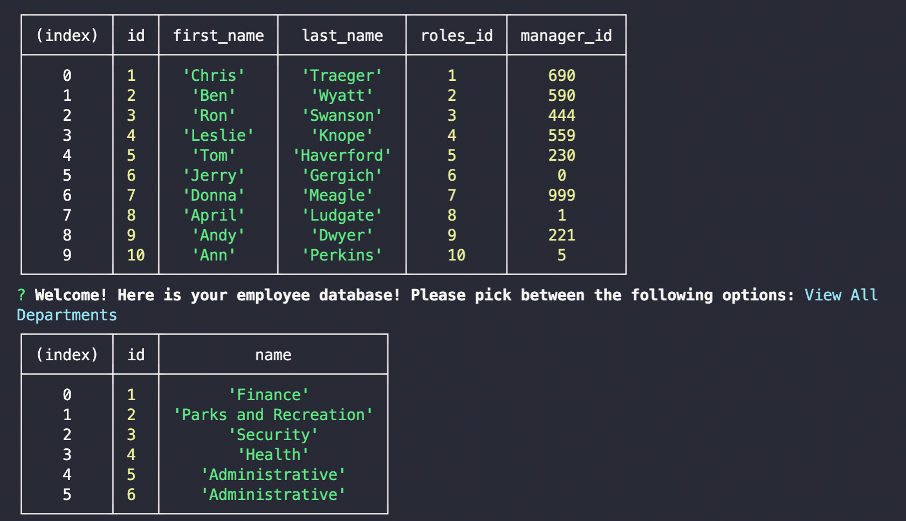

## No One Achieves Anything Alone /// Team Tracker Generator!!!
    
 ## Table of Contents 
 1. [Screenshots](#screenshots)
 2. [Description](#description)
 3. [Usage](#usage)
 4. [Credits](#credits)
 5. [Collaborators](#collaborators)
 6. [Features](#features)
 7. [License](#license)
 8. [Contact](#contact)
 
 ## Screenshots
 - 
 - 
 - 

 ## Video

https://user-images.githubusercontent.com/106720762/188680953-bf626884-460c-400b-99db-b4411ec2d15e.mp4

 
 ## Video Link
  - [The Drive Link w/ the SECOND Parks & Rec-inspired Team Generator](https://drive.google.com/file/d/1adtB74MDHx5KXdodrL1DN8hsfke49OSD/view?usp=sharing)
 
 ## Description 
 - The purpose of this application is to allow each user to: add the applicable department, roles, names, and salaries. The application also allows the user to update and delete each employee, as needed. 
    This product uses node, inquirer, and MYSQL in a harmonious, little-coding-triangle.
 
 ## Usage
 - In order to follow the guide for this project, one must follow the intended prompts, and add their team members as appropriate. When the user runs node index.js into their terminal, the prompts and lists will begin, allowing the user with full-choice of their options.
 
 ## Credits
 - BIG shoutout to our largest study group yet! Parker, Kit, Axel, Kristen, Kristina, Lesli -- you are all rockstars. I love our collaboration, and our abillities to help each other!! Even the moral support helps. :sparkling_heart: :star2:
 
 ## Collaborators
 - N/A
 
 ## Features
 - N/A
 
 ## License
 - NONE
 - if you'd like to use my work, feel free to, but please let me know prior to.
